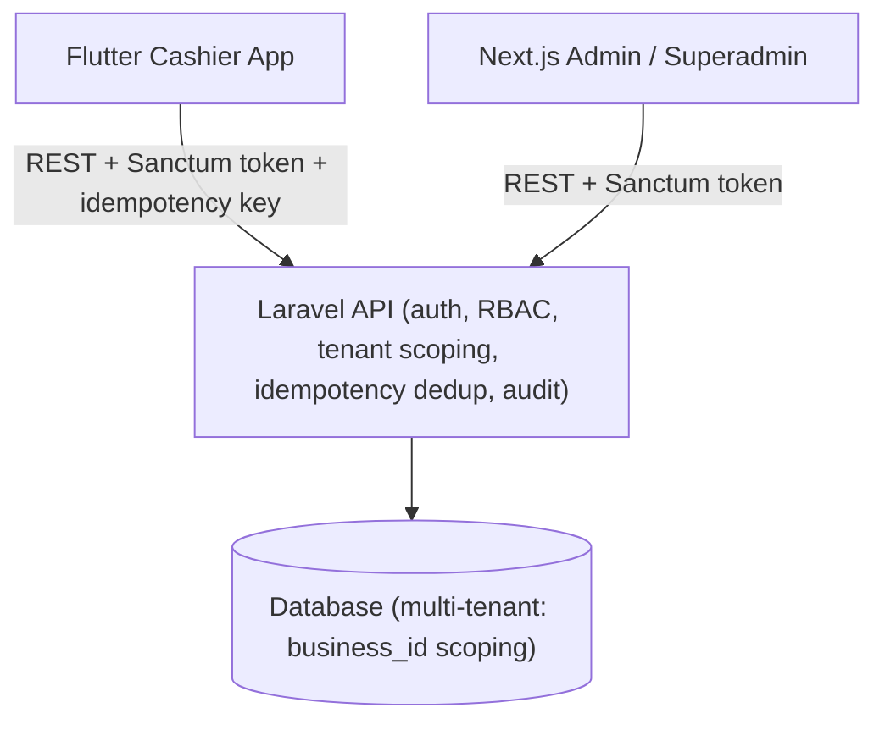

# NojPOS PRD — MVP

<aside>
📌

**Status:** Source of truth produk & arsitektur MVP.

**Tanggal:** 2026-06-17 · **Revisi:** 8 — konsolidasi (shift lifecycle, flow gaps, onboarding/offline, payments, printing, security).

MVP NojPOS = aplikasi kasir **online-first** di tablet/mobile, terhubung ke satu **Laravel API multi-tenant**, dikelola lewat **Next.js Admin/Superadmin**.

</aside>

## 1. Ringkasan & Positioning

NojPOS adalah POS SaaS Indonesia untuk UMKM retail, F&B, jasa, dan outlet hybrid.

**Keputusan resmi:**

- NojPOS MVP adalah **online-first POS SaaS**; mengoverride dokumen lama yang menyebut offline-first wajib.
- Offline-first penuh = **Phase 2**, bukan MVP.
- MVP memakai **checkout outbox ringan**: checkout yang gagal kirim karena network disimpan sementara di device lalu di-retry **satu arah** ke server.
- **Idempotency key wajib** sejak hari pertama untuk endpoint write transaksional.
- PRD ini = source of truth untuk product scope, arsitektur, data model, kontrak API, dan urutan eksekusi MVP.

**Grounding kondisi aplikasi saat ini:**

- Aplikasi 100% UI prototype di atas local Riverpod + seed mock. REAL API: 0; tidak ada `dio`/`http` di `pubspec.yaml`.
- Repository interface sudah ada tapi belum diimplementasikan/dipakai: `lib/core/repositories/nojpos_repositories.dart:4`.
- Jalur inti POS hidup di local state: login → PIN → produk → cart → simpan order → bayar → struk.
- `completeTransaction` masih lokal di `lib/core/mock/mock_app_state.dart:103` — titik konseptual masuknya idempotency key + repository/API checkout.
- Data model lokal sudah mendukung `List<PaymentLine>` (`nojpos_models.dart:124`) dan `ShiftSession` (`nojpos_models.dart:179`).
- Offline-first machinery belum ada (tidak ada Drift, sync queue, conflict resolver).
- Audit elemen interaktif: WORKING 24, PARTIAL 8, MOCK 18, DEAD 10, NAV-ONLY 15.

## 2. Goals & Non-Goals

### Goals MVP

- Mengubah prototype Flutter dari mock-only → cashier-first app yang memakai Laravel API.
- Menyelesaikan happy path kasir: login akun → PIN switch → open shift → katalog → cart → checkout → payment → struk → riwayat → close shift.
- Merealisasikan elemen DEAD/MOCK/PARTIAL sesuai wave terprioritas.
- Menjaga Flutter feature-first dengan repository boundary.
- Satu Laravel API untuk Flutter Cashier & Next.js Admin/Superadmin.
- Transaksi aman terhadap retry via idempotency key.
- Semua data domain ter-scope `business_id`.

### Goals Phase 2

- Offline-first penuh dengan Drift production DB.
- Sync dua arah (`/sync/pull`, `/sync/push`), conflict resolver, background retry umum, server reconciliation.
- DB-per-tenant bila kebutuhan enterprise menuntut isolasi fisik.
- Printer production adapter lanjutan, QRIS dinamis/payment gateway, integrasi eksternal besar.

### Non-Goals MVP

Drift production DB · sync dua arah · conflict resolver · DB-per-tenant · marketplace integration · advanced accounting · AI features · multi-warehouse kompleks · payment gateway/QRIS dinamis · barcode scanner · kitchen ticket/multi-printer.

## 3. Arsitektur Sistem



- **Flutter Cashier App** — kasir cepat, cashier-first, online-first, dengan checkout outbox ringan khusus transaksi.
- **Next.js Admin** — dashboard merchant: product, inventory lengkap, staff, outlet, reports, settings, subscription, setup wizard.
- **Next.js Superadmin** — console operator SaaS: tenant, plans, subscription, billing, audit, feature flags, provisioning tenant.
- **Laravel API** — satu API untuk semua client; auth, RBAC, tenant scoping, transaction integrity, idempotency, inventory, reports, subscription, audit.
- **Database** — single database multi-tenant dengan `business_id` di semua tabel domain.

## 4. Multi-Tenancy & Hierarki Data

Single database multi-tenancy dengan kolom `business_id` di semua tabel domain. Laravel wajib menerapkan **global scope/middleware** agar query domain selalu dibatasi `business_id` sesuai token/session.

```
Business (tenant)
  -> Outlets
    -> Devices
    -> Cashiers
    -> Shifts
      -> Transactions
        -> TransactionItems
        -> Payments
        -> Refunds / Voids
```

**Aturan:**

- Semua transaksi wajib punya `business_id`, `outlet_id`, `shift_id`, `device_id`, `cashier_id`.
- Semua master data tenant (products, categories, customers, staff, inventory, reports) wajib ter-scope `business_id`.
- Data operasional outlet wajib menambahkan `outlet_id` bila relevan.
- Superadmin membaca lintas-business melalui **gate khusus**, bukan dengan mematikan scoping.
- DB-per-tenant = Phase 2/future.

## 5. Onboarding & Provisioning

**A1. Tenant provisioning (keputusan resmi):** Saat launch, pembuatan tenant dilakukan **Superadmin** (tanpa self-serve signup). Superadmin membuat business, menetapkan plan/limit, dan membuat akun owner awal. Self-serve signup + trial = future.

**A2. Business setup (Next.js Admin, oleh owner/admin):** lengkapi profil business, outlet, konfigurasi pajak + service charge **per outlet**, metode pembayaran, produk/kategori awal, staff + PIN, device. Flutter "siap pakai" setelah produk + outlet + minimal 1 cashier tersedia.

**A3. Aktivasi & identitas device (keputusan resmi):**

- Model: **account login** (ala Moka/majoo). User login dengan kredensial, lalu memilih outlet yang diizinkan.
- `device_id` = **stable install ID** yang dihasilkan/disimpan aman saat aplikasi pertama berjalan.
- Tidak ada registry device/pairing code di MVP.
- **Tradeoff & mitigasi:** tanpa registry, batas device dari subscription di-enforce **longgar** berdasarkan jumlah device-session aktif per outlet (server menolak/menandai bila melebihi limit plan). Registry device + pairing code = future.

**A4. Staff & PIN:** owner/admin membuat akun cashier + PIN di Admin; flow set/reset PIN dan ganti password pertama dilakukan di Admin. PIN switch tetap sesuai §7 (server-verified).

**A5. First-run Flutter (urutan layar):**

```
Splash -> cek token tersimpan?
  belum/expired -> Login akun -> pilih outlet -> PIN switch -> shift guard -> POS
  valid         -> PIN switch -> shift guard -> POS
```

Forgot password mengarah ke flow reset (email/HP).

**A6. Subscription / plan / trial gating:** Superadmin set plan + limit (outlet/device/produk). Saat trial habis / limit tercapai → mode terbatas (mis. read-only / blokir checkout) dengan pesan jelas. `/subscription` mengembalikan plan + limit aktif.

**A7. Klarifikasi account vs device:** Login = kredensial **user** (email/HP + password) milik suatu business. Device = instalasi aplikasi dengan stable `device_id`; bukan akun terpisah.

## 6. Auth & Otorisasi

Laravel **Sanctum** token-based auth untuk Flutter dan Next.js.

**Alur Flutter:**

1. Account login ke Laravel API → menerima Sanctum token.
2. Token disimpan aman di device (secure storage).
3. PIN dipakai untuk switch kasir cepat di device yang sama via `POST /auth/pin-switch`.
4. PIN switch diverifikasi server, rate-limited, dan menghasilkan audit trail.
5. PIN bukan auth utama; PIN hanya pemilih cashier yang sudah diizinkan di device/outlet tersebut.
6. Endpoint cashier digerbang role cashier + permission outlet.

**Roles minimal:**

| Role | Client utama | Akses endpoint group |
| --- | --- | --- |
| `superadmin` | Next.js Superadmin | Tenants/businesses, plans, subscriptions, SaaS payments, users, audit logs, feature flags |
| `owner` / `admin` | Next.js Admin | Products, categories, customers, inventory lengkap, staff, outlets, reports, settings, subscription |
| `cashier` | Flutter Cashier App | Me/session, outlets diizinkan, products read, customers ringan, shifts, transactions, payments, refunds/voids terbatas |

**Otorisasi:** gunakan Policy/Gate Laravel. Jangan membuat dua API terpisah; satu API dengan gate & scope berbeda.

## 7. Shift Lifecycle & Gating

**Model shift (keputusan resmi): per-device / shared drawer.**

- Satu shift OPEN per kombinasi **device + outlet**. PIN switch mengubah cashier aktif saja, **tidak** membuka shift baru.
- **Shift guard:** sebelum masuk POS, aplikasi memastikan ada shift OPEN untuk device+outlet ini; jika tidak ada → arahkan ke layar **Buka Shift** (input opening cash).
- **Resume:** saat app restart dengan shift masih OPEN di server, lanjutkan shift tersebut (jangan paksa buka baru).
- **Tutup shift:** **kasir boleh menutup sendiri** (tanpa PIN supervisor). Verifikasi opsional dapat dikonfigurasi di future.
- **Urutan flow:** Login → pilih outlet → PIN switch → **shift guard (buka/resume)** → POS.
- `GET /shifts/current` mengembalikan shift OPEN untuk device+outlet aktif.
- Tutup shift diblokir bila masih ada outbox checkout pending/sending/needs-action (lihat §9).

## 8. Strategi Online-First + Checkout Outbox

MVP online-first; Flutter memanggil Laravel API langsung untuk data utama.

**Checkout outbox ringan (wajib, khusus transaksi):**

- **Trigger:** network fail/timeout/server unreachable saat `POST /transactions`.
- **Scope:** hanya checkout transaksi, satu arah device → server.
- **Penyimpanan lokal:** queue kecil berisi payload checkout final, `idempotency_key`, timestamp, retry count, status, last error.
- **Retry:** otomatis saat reconnect & saat app foreground. Backoff 5s → 30s → 2m (cap 2m). Terus mencoba selama app terbuka.
- **Needs-action:** tandai "Gagal butuh tindakan" setelah **5 kegagalan beruntun** atau **15 menit** belum terkirim.
- **Manual resolution:** item outbox **tidak pernah auto-discard**; kasir/supervisor wajib retry sampai terkirim atau resolusi manual tercatat.
- **Status UI:** "Tersimpan menunggu kirim", "Mengirim ulang", "Terkirim", "Gagal butuh tindakan".
- **Outbox UI dasar = Wave 1** (badge jumlah pending + daftar pending + tombol "Kirim ulang" manual). Notification center penuh = Wave 3.
- **Batas:** tidak menyentuh master data, tidak pull sync, tidak ada conflict resolver, tidak menggantikan server sebagai source of truth.

**Close shift diblokir** selama ada item outbox berstatus pending/sending/needs-action milik shift tersebut, agar expected vs actual cash akurat dan tidak ada transaksi nyangkut.

Checkout outbox bukan offline-first penuh — hanya safety net agar checkout tidak hilang saat koneksi jatuh tepat saat submit.

## 9. Offline Readiness (Phase 2 Boundary)

**B1. Forward-compat adopsi MVP (keputusan resmi):**

- **UUID v4** sebagai identitas record transaksional sejak MVP (selaras idempotency).
- Laravel timestamps `created_at`/`updated_at` di **semua** tabel domain (gratis dari Eloquent; `updated_at` jadi cursor `/sync/pull` future).
- **Soft delete** (`deleted_at`, trait `SoftDeletes`) di tabel master + transaksional (dibutuhkan rekonsiliasi sync).

**B2. Profil sync NojPOS (didokumentasikan agar Phase 2 murah):**

- Transaksi bersifat **append-only** → konflik minimal; server terima semua, dedup via idempotency key (jembatan ke `/sync/push`).
- Master data (produk, customer) **read-only** di device → Phase 2 cukup pull-only, tanpa conflict resolver.
- Satu-satunya konflik nyata = **stok** (oversell saat offline) → kebijakan oversell reconciliation = Phase 2.

**B3. Anti-scope-creep:** checkout outbox MVP tetap **checkout-only**, satu arah, tidak menyentuh master/pull/conflict. Generalisasi ke semua write = Phase 2 via `/sync/push`.

**B4. Prinsip arsitektur:** repository seam (Wave 0) memungkinkan Phase 2 membungkus `Api*Repository` dengan **cache-aside repo + Drift** tanpa mengubah UI/provider.

## 10. Idempotency & Integritas Transaksi

Idempotency wajib untuk: `POST /transactions`, `POST /payments`, `POST /refunds`, `POST /voids`.

**Format:**

- Client generate UUID v4 per aksi transaksional → header `Idempotency-Key: <uuid>`.
- Payload boleh menyertakan `client_request_id` untuk observability.
- Laravel menyimpan `business_id`, endpoint/action, idempotency key, request hash, response snapshot, status, created_at.

**Server behavior:**

- Key baru → proses, simpan response, kembalikan normal.
- Key sama + hash sama → kembalikan response sebelumnya tanpa duplikat.
- Key sama + hash beda → error `409` conflict.
- Dedup wajib **scoped per `business_id`** (cegah replay lintas-tenant).

**Client behavior:** retry outbox memakai key yang sama; jangan generate key baru untuk retry; UI tidak boleh membuat transaksi kedua saat retry.

**Aturan transaksi:** Transaction & Payment dipisah; satu transaction bisa multiple payments; paid transaction tidak diedit langsung (koreksi via void/refund); stock movement dibuat dari transaction paid, refund, void, purchase, adjustment; semua nilai uang **integer rupiah**.

## 11. Transaction Status State Machine

```
draft -> held -> unpaid -> partial -> paid -> (voided | refunded)
```

- **draft** — cart aktif belum disimpan.
- **held** — order di-park/disimpan (lihat §13 hold/park).
- **unpaid** — transaksi tercatat, belum ada pembayaran confirmed.
- **partial** — sebagian pembayaran confirmed (mis. split payment Wave 2).
- **paid** — total pembayaran confirmed ≥ total tagihan.
- **voided** — pembatalan transaksi (lihat §13).
- **refunded** — pengembalian dana (lihat §13).

Transisi paid → voided/refunded hanya melalui aksi terkontrol + audit.

## 12. Pricing: Diskon, Service Charge, Pajak, Rounding

**Konfigurasi per outlet (keputusan resmi):** pajak + service charge **configurable per outlet**.

**Urutan kalkulasi (integer rupiah):**

```
subtotal
  - diskon item
  - diskon cart
  = base
  + service charge
  + pajak
  + rounding adjustment
  = grand total
```

- **Precedence diskon:** diskon item diterapkan dulu, lalu diskon cart pada subtotal setelah diskon item.
- **Service charge** dihitung atas base (setelah diskon), **pajak** dihitung atas base + service charge (urutan dikunci di atas).
- **Rounding:** pembulatan akhir ke rupiah bulat; selisih pembulatan dicatat sebagai komponen tersendiri agar laporan konsisten.
- Semua nilai uang **integer**, tidak ada floating point.

## 13. Void & Refund

| Aksi | Wave | Aturan |
| --- | --- | --- |
| **Void** | Wave 2 | Pembatalan penuh dalam shift yang sama; wajib alasan; auto-reverse stok + kas; dari riwayat transaksi. |
| **Refund (full, tunai)** | Wave 3 | Pengembalian dana penuh secara tunai; reverse stok + kas; wajib alasan + approval. |
| **Partial refund** | Phase 2 | Refund sebagian item/nominal. |
- Void dan refund **dipisah**; void menutup ~80% kebutuhan koreksi dengan kompleksitas terendah.
- Refund non-tunai (ke e-wallet/transfer) = future (butuh gateway).
- Setiap void/refund menulis entri **audit** (actor, alasan, timestamp, before/after) — lihat §17.

## 14. Cash Management

- **Cash in/out** selama shift dicatat (alasan + nominal + actor); memengaruhi expected cash.
- **Formula expected cash:**

```
expected_cash = opening_cash + cash_sales + cash_in - cash_out - cash_refunds
```

- Pembayaran **non-tunai tidak masuk** perhitungan expected cash.
- **Z-report / tutup shift** menampilkan: opening cash, cash sales, cash in/out, cash refunds, expected cash, actual cash, selisih, **dan total per metode pembayaran** (tunai vs QRIS vs transfer vs e-wallet).

## 15. Payments & QRIS

**P1. Metode pembayaran MVP (keputusan resmi):** Tunai (selalu ada), **QRIS Statis**, **Transfer bank** (referensi manual), **E-wallet** (referensi manual). Tidak termasuk MVP: EDC/kartu, QRIS Dinamis, payment gateway → future.

**P2. Konfigurasi per outlet:** metode aktif diatur per outlet. Tiap metode punya nama, jenis (`tunai`/`qris_statis`/`transfer`/`ewallet`), status aktif, dan flag `is_cash` (true hanya tunai).

**P3. Model QRIS (keputusan resmi):** MVP = **QRIS Statis** saja — QR merchant ditampilkan/dicetak, pelanggan input nominal sendiri, kasir mencatat manual. QRIS Dinamis + gateway + webhook auto-confirm = future.

**P4. Lifecycle status pembayaran:** tunai → langsung `confirmed` (hitung kembalian); non-tunai → `pending → confirmed | failed`. Transaksi `paid` hanya setelah total pembayaran `confirmed` ≥ total tagihan.

**P5. Konfirmasi non-tunai (anti-fraud, keputusan resmi):** konfirmasi = tindakan **sengaja** kasir ("Tandai sudah diterima"), **bukan** berdasarkan screenshot pelanggan. Kasir mengisi referensi manual opsional (4 digit terakhir/nama pengirim). Catat audit (actor + timestamp).

**P6. Kembalian & split:** kembalian hanya untuk tunai. Split payment (tunai + QRIS) = Wave 2.

**P7. Rekonsiliasi:** non-tunai tidak masuk laci kas; tutup shift/Z-report menampilkan total **per metode** terpisah (lihat §14).

**P8. MDR/settlement (keputusan resmi):** MVP mencatat **bruto saja** (tanpa gateway, QRIS milik merchant settle di banknya). Tracking MDR/netto + laporan settlement = future. Referensi tarif MDR (15 Mar 2025): UMI ≤Rp500rb 0% / >Rp500rb 0,3%; UKE/UME/UBE 0,7%; MDR ditanggung merchant, dilarang dibebankan ke konsumen.

## 16. Printing & Hardware

**H1. Printer struk (keputusan resmi):** target utama **thermal Bluetooth 58mm** via standar **ESC/POS**. Lebar kertas configurable: **58mm (default) + 80mm** sebagai setting per device/outlet. Kitchen ticket/multi-printer = future.

**H2. Prinsip cetak best-effort (kritis):** mencetak struk **tidak pernah memblok** transaksi — sale tetap `paid` walau printer mati/tidak ada. Struk bisa dicetak ulang dari riwayat. Sediakan opsi **struk digital** (share/WhatsApp) sebagai fallback.

**H3. Laci kas:** dipicu lewat **printer kick** (kabel RJ11/RJ12 ke printer) via perintah ESC/POS. Auto-open hanya saat printer terhubung; tanpa printer = buka manual. Trigger: penyelesaian transaksi tunai, cash-in/out, tutup shift (configurable).

**H4. Barcode scanner:** **ditunda** ke wave berikutnya (bukan MVP). Rencana future: keyboard-wedge (Bluetooth/USB) yang mengisi field pencarian produk.

**H5. Konten & kustomisasi struk (per outlet):** header (logo/nama outlet, alamat, kontak); body (item + qty + harga, subtotal, diskon item/cart, service charge, pajak, total); pembayaran (metode, nominal bayar, kembalian, nomor transaksi, nama kasir, tanggal/waktu); footer (catatan kustom per outlet).

## 17. Security & Audit

**S1. Isolasi tenant (keputusan resmi):** semua query domain wajib ter-scope `business_id` (global scope + policy). **Wajib ada test isolasi tenant**.

**S2. RBAC per endpoint:** superadmin/owner-admin/cashier; cashier tidak boleh akses endpoint admin/superadmin.

**S3. Rate-limit & lockout (keputusan resmi):** login, PIN, dan PIN switch → lockout setelah **5 percobaan gagal → kunci 15 menit**. Throttling pada endpoint auth.

**S4. Audit log (keputusan resmi, cakupan MVP):** aksi **uang + auth-sensitive** — void, refund, cash-in/out, override diskon/harga, buka/tutup shift, PIN switch, login. Setiap entri: actor, timestamp, jenis aksi, before/after bila relevan. **Immutable** (tidak bisa diedit/dihapus user biasa). Full audit semua write = future.

**S5. Keamanan PIN & token:** PIN **di-hash** (bukan plaintext) per-business; PIN ≠ password. Token Sanctum di secure storage; ada expiry/rotasi; **di-revoke saat logout** (shift tetap open server-side sesuai §7); scope token per role.

**S6. Idempotency:** key di-scope per `business_id` (cegah replay lintas-tenant).

**S7. Privasi & retensi (UU PDP):** PII customer (nama/HP) diperlakukan sesuai UU PDP; gunakan soft delete (§9) untuk retensi & rekonsiliasi; sediakan kebijakan ekspor/hapus data saat offboarding tenant. DLP/enkripsi-at-rest lanjutan = future.

**S8. Transport:** seluruh komunikasi API wajib **TLS/HTTPS**.

## 18. Token Expiry, Logout, Lock & Degraded Mode

- **Token expiry mid-shift:** jika token expired saat shift berjalan, minta re-login akun; shift tetap OPEN di server dan di-resume setelah login.
- **PIN switch** = ganti cashier aktif. **Lock** = kembali ke layar PIN (token tetap). **Logout** = revoke device token (shift tetap open server-side).
- **Negative stock:** MVP **mengizinkan dengan peringatan** (hard block = future).
- **Degraded mode:** saat server tidak reachable, hanya checkout yang masuk outbox; operasi yang butuh data server (mis. buka shift, load produk baru) ditandai tidak tersedia dengan pesan jelas — bukan offline-first.

## 19. Scope Fitur MVP (Peta dari Audit)

Semua elemen DEAD/MOCK/PARTIAL masuk MVP. Wave = urutan eksekusi, bukan out-of-scope.

### Wave 1 — Core happy path

- **Login → Outlet selector** (`login_screen.dart:66`, DEAD) → pilih outlet diizinkan dari `/outlets`.
- **Login → Kasir selector** (`login_screen.dart:72`, DEAD) → pilih/switch cashier dari `/me`,`/outlets`.
- **PIN** (`pin_screen.dart:17`, MOCK) → validasi server-side via `/auth/pin-switch`; rate-limited + audit.
- **Product catalog** (`pos_providers.dart:54`, MOCK) → produk/kategori dari `/products` scoped business/outlet.
- **Payment summary** (`payment_screen.dart:652`, MOCK) → customer/order number dari cart/session + response `/transactions`.
- **Tutup Kasir dialog** (`pos_dialogs.dart:405`, MOCK) → close shift real (expected vs actual cash) via `/shifts/{id}/close`.
- **Close shift keypad** (`pos_dialogs.dart:485`, DEAD) → verifikasi cashier (self-close, tanpa PIN supervisor).
- **Shift guard + buka shift** (baru) → cek `GET /shifts/current`, buka via `/shifts/open`.
- **Cash payment + checkout** via repository + idempotency.
- **Receipt builder** dengan data transaksi nyata.
- **Outbox UI dasar** (badge + daftar pending + kirim ulang manual).

### Wave 2 — Secondary transactional

- **Diskon item/cart** (`order_panel.dart:320`, MOCK) → tersimpan di transaction payload (precedence §12).
- **Pelanggan Baru** (`pos_dialogs.dart:253`, MOCK) → form tambah customer real via `/customers` (cashier boleh di semua plan MVP).
- **Search pelanggan** (`pos_dialogs.dart:306`, DEAD) → `/customers?search=`.
- **Customer tabs/group** (`pos_dialogs.dart:739`, DEAD) → `/customers?group=`.
- **Dilayani Oleh** (`pos_dialogs.dart:160`, mapper `pos_screen.dart:101`, PARTIAL) → simpan `served_by`.
- **Non-tunai/Transfer/QRIS** (`payment_screen.dart:54`, PARTIAL) → referensi manual, provider, status, validasi via `/payments`.
- **Pisah Bayar** (`payment_screen.dart:358`, MOCK) → multiple payment lines.
- **Jadikan Invoice** (`payment_screen.dart:358`, MOCK) → simpan held/unpaid sederhana; invoicing penuh di Next.js Admin/future.
- **Catatan** (`payment_screen.dart:330`, PARTIAL) → simpan note ke transaction payload.
- **Orders held filter** (`operations_screen.dart:773`, DEAD) → `/transactions?status=held`.
- **Void** (baru, dari riwayat) → §13.
- **Hold/park order** (baru) → state `held` §11.

### Wave 3 — Operational

- **Reports** (`operations_screen.dart:408/490/976`, DEAD/MOCK) → ringkasan current shift/day via `/reports/sales-summary`; report lengkap di Next.js Admin; hapus chart dummy.
- **Inventory** (`operations_screen.dart:511/524`, DEAD) → `/inventory*` (owner/admin).
- **Settings produk/kategori** (`operations_screen.dart:578/1101/1154`, DEAD) → `/products`,`/categories`.
- **Attendance** (`operations_screen.dart:1534/1558/1577`, DEAD/PARTIAL) → `/attendance` + keypad + employee selector.
- **Barcode scanner** (`product_catalog.dart:119`, MOCK) → ditunda (future).
- **Lock/Logout** (`top_bar.dart:84`, `pos_dialogs.dart:77`) → §18.
- **Sidebar operasional** (Buku Menu/Promo/Kas) (`pos_sidebar.dart:79/85/91`, MOCK).
- **NojPOS Care** (`pos_dialogs.dart:62`, MOCK) · **Notifikasi** (`pos_screen.dart:65`, MOCK) · **Bagikan/Cetak struk** (`success_screen.dart:92/107`, MOCK).
- **Refund (full, tunai)** (baru) → §13.

## 20. Kontrak API (REST Online-First, Tenant-Aware)

Semua endpoint di bawah `/api/v1`, butuh `Accept: application/json`, dan ter-scope `business_id` terotentikasi kecuali superadmin.

| Endpoint | Method | Ringkasan | Role | Idempotency |
| --- | --- | --- | --- | --- |
| `/auth/login` | POST | Account login; response Sanctum token, user, business, outlets | semua | No |
| `/auth/pin-switch` | POST | Server-verified PIN switch cashier di device/outlet aktif; rate-limited + audit | cashier | No |
| `/auth/logout` | POST | Revoke current token | authenticated | No |
| `/me` | GET | User, business, outlet/device session, permissions | authenticated | No |
| `/outlets` | GET | Outlets diizinkan untuk user/device | cashier, owner, admin | No |
| `/products` | GET | Products/categories, scoped, support search/barcode/category | cashier, owner, admin | No |
| `/products` | POST | Create product (admin) | owner, admin | No |
| `/customers` | GET | List/search customers | cashier, owner, admin | No |
| `/customers` | POST | Create customer | cashier, owner, admin | No |
| `/shifts/open` | POST | Buka shift (opening cash, outlet, device, cashier) | cashier | Optional |
| `/shifts/current` | GET | Shift OPEN untuk device+outlet aktif | cashier | No |
| `/shifts/{id}/close` | POST | Tutup shift (actual cash, self-close) | cashier, supervisor/admin | Yes |
| `/shifts/{id}/cash-movements` | POST | Cash in/out selama shift | cashier | Optional |
| `/transactions` | POST | Create transaksi (items, payments, shift, customer, diskon, notes) | cashier | Yes |
| `/transactions` | GET | Riwayat transaksi dengan filter | cashier limited, owner, admin | No |
| `/payments` | POST | Tambah/konfirmasi payment line; non-tunai pending/confirmed | cashier | Yes |
| `/refunds` | POST | Refund + efek stok/kas | supervisor/admin, cashier bila diizinkan | Yes |
| `/voids` | POST | Void transaksi + alasan + approval | supervisor/admin, cashier bila diizinkan | Yes |
| `/inventory` | GET | List stok/purchase movement | owner, admin, cashier limited | No |
| `/inventory/purchases` | POST | Create purchase/faktur + stock movement | owner, admin | Optional |
| `/reports/sales-summary` | GET | Metrik penjualan; cashier limited current shift/day | cashier limited, owner, admin | No |
| `/subscription` | GET | Plan + limit device/outlet/produk aktif | owner, admin, superadmin | No |
| `/invoices` | POST | Future: invoicing/receivable/due/collection | future | Future |
| `/sync/pull` | GET | Future offline-first pull | future | Future |
| `/sync/push` | POST | Future offline-first push | future | Future |

Semua write wajib memvalidasi: `business_id` dari token scope (bukan dari client), `outlet_id` milik business, `shift_id` milik outlet/business & open bila diperlukan, nilai uang integer, dan idempotency dedup untuk write transaksional.

### 20.1 Response & Error Envelope

Sukses:

```json
{ "data": {}, "meta": {} }
```

Error:

```json
{ "error": { "code": "STRING", "message": "STRING", "details": {} } }
```

**Status codes:** `200`/`201` sukses · `401` unauthenticated · `403` forbidden (role/permission/tenant gate/outlet scope) · `404` not found / tidak terlihat di scope · `409` conflict (termasuk idempotency key dipakai ulang dengan request hash berbeda) · `422` validation · `500` server error.

Idempotency conflict `409` harus jelas dibedakan dari validation `422`. Key sama + hash sama → kembalikan stored response; key sama + hash beda → `409`.

## 21. Data Model

Konsep model yang dipertahankan: Business · Outlet · Device · User · Role · ShiftSession · Product · ProductCategory · ProductVariant · Customer · Cart · HeldOrder/SalesOrder · Transaction/SalesTransaction · TransactionItem/OrderLine · Payment/PaymentLine · Refund · Void · StockMovement · InventoryPurchase · Subscription · **AuditLog** · **PaymentMethodConfig** (per outlet).

**Tenant columns:** tambah `business_id` ke semua tabel domain; `outlet_id` ke tabel outlet-operational; `device_id`, `cashier_id`, `shift_id` ke tabel transaksi/shift-relevant.

**Forward-compat (MVP, §9):** `id` UUID, `created_at`/`updated_at`, `deleted_at` (soft delete) pada tabel domain.

**MVP fields:** `idempotency_key` pada record write transaksional; `client_request_id` opsional; `business_id`, `outlet_id`, `shift_id`, `device_id`, `cashier_id`.

**Payment fields:** `method`, `reference`, `status` (`pending|confirmed|failed`), `confirmed_by`, `confirmed_at`, `is_cash`.

**AuditLog fields:** `actor`, `action`, `entity`, `before`, `after`, `timestamp`, `business_id`.

**Future sync labels:** `server_id`, `sync_status`, `SyncQueueItem`, `/sync/pull`, `/sync/push`.

## 22. Rencana Repository Boundary

Interface sudah ada di `lib/core/repositories/nojpos_repositories.dart:4`. MVP implementasi API-backed repo + swap provider per fitur.

1. Pertahankan folder feature-first.
2. Implementasi API client + auth/session storage di luar widget.
3. Implementasi `AuthRepository`, `ProductRepository`, `CustomerRepository`, `OrderRepository`, `TransactionRepository`, `InventoryRepository`, `AttendanceRepository`, `ShiftRepository`.
4. Ganti panggilan mock provider dengan repository-backed provider.
5. Local provider state hanya untuk screen state, cart draft, dan checkout outbox.
6. Hapus dependensi mock seed setelah API equivalent ada.

**Mock untuk dihapus/diganti:** `mock_seed_data.dart` (outlet, employees, customers, categories, products); `mock_app_state.dart` (session, saved orders, transactions, purchases, attendance, `completeTransaction`); katalog hardcoded `pos_providers.dart:54`; summary hardcoded `payment_screen.dart:652`; login statis `login_screen.dart:66`; mock snack `pos_dialogs.dart:606`, `payment_screen.dart:358`.

## 23. Acceptance Criteria Wave 1

**Auth/session:** login API + Sanctum token; token tersimpan aman; `/me` mengembalikan user/business/permissions/outlets; PIN switch menolak PIN invalid & hanya memilih cashier di device/outlet aktif.

**Outlet:** cashier hanya melihat outlet diizinkan; outlet terpilih disertakan di product/shift/checkout call.

**Shift:** wajib buka shift sebelum checkout (shift guard); resume shift OPEN saat restart; close shift submit actual cash → expected cash, selisih, status; tidak bisa close dua kali; close ditolak bila ada outbox pending/sending/needs-action milik shift, dengan pesan jelas.

**Products:** grid load dari `/products`; filter search/kategori/favorit pakai data API/cache; state empty/loading/error terlihat.

**Cart:** add/increase/decrease/remove/clear bekerja; total integer rupiah; tidak bisa checkout saat kosong.

**Cash payment & checkout:** pembayaran tunai membuat transaksi via repository/API; `POST /transactions` menyertakan idempotency key; retry key sama tidak duplikat; gagal network → masuk outbox + status pending; retry sukses → clear outbox item.

**Outbox UI:** badge jumlah pending + daftar pending + tombol kirim ulang manual terlihat.

**Receipt:** success screen menampilkan nomor transaksi, customer, payment lines, paid total, kembalian; receipt builder punya data print/share-ready walau printer adapter belum production.

**Transaction history:** transaksi paid muncul di Sales setelah API sukses atau setelah outbox retry sukses.

## 24. Risiko & Resolved Decisions

**Risiko & mitigasi:**

- Scope "real-kan semua DEAD/MOCK/PARTIAL" besar walau di-wave → jaga timeline ketat per wave.
- Checkout outbox bisa melebar jadi offline-first terselubung → scope dikunci checkout satu arah, tanpa master/pull/conflict (§8, §9).
- Transaksi outbox bisa bikin expected vs actual cash meleset → close shift diblokir bila ada outbox pending/sending/needs-action (§8, §14).
- Tanpa idempotency dari awal → retry network bisa duplikat (§10).
- Tanpa enforce `business_id` otomatis → risiko data leak antar tenant; mitigasi global scope + test isolasi (§17).
- Flutter menambah admin-heavy feature → cashier app membesar/melambat; jaga cashier-first.
- Repository boundary diabaikan → migrasi mock→API menyentuh terlalu banyak widget.
- Tanpa registry device (account-login) → enforcement limit device longgar; mitigasi hitung device-session aktif per outlet (§5).

**Resolved decisions:**

- PIN switch via `POST /auth/pin-switch` (server-verified, rate-limited, audit).
- Cashier boleh buat customer baru di semua plan MVP; gating per-plan = future.
- Flutter cukup simpan unpaid/held sederhana; invoicing penuh di Next.js Admin/future.
- Flutter hanya ringkasan current shift/day; report lengkap di Next.js Admin.
- Outbox auto-retry reconnect & foreground; backoff 5s→30s→2m cap 2m; needs-action 5x gagal/15 mnt; tidak pernah auto-discard.
- **Shift = per-device/shared drawer**; cashier self-close; shift guard sebelum POS; resume shift OPEN; close diblokir bila outbox pending.
- **Void → Wave 2**; refund full tunai → Wave 3; partial refund → Phase 2.
- **Pajak + service charge per outlet**; urutan kalkulasi & rounding dikunci (§12).
- **Outbox UI dasar → Wave 1**; notification center → Wave 3.
- **Tenant via Superadmin**; **device = account login + stable install ID**; enforcement device longgar.
- **Forward-compat MVP**: UUID + `updated_at` + soft delete.
- **Metode bayar MVP**: tunai, QRIS statis, transfer manual, e-wallet manual; QRIS statis-only; konfirmasi manual sengaja (anti-screenshot); bruto-only.
- **Printing**: 58mm utama + 80mm setting; cetak best-effort; laci via printer kick; barcode ditunda.
- **Security**: audit money+auth; PIN lockout 5x/15 mnt; PIN hashed; token revoke saat logout; TLS wajib; idempotency per `business_id`.
- Negative stock: allow with warning (hard block = future).

## 25. Revisi Log

| Revisi | Cakupan |
| --- | --- |
| 2 | Open questions resolved (baseline) |
| 3 | Shift lifecycle & gating (§7) |
| 4 | 14 flow gaps (state machine, void/refund, pricing, cash mgmt, degraded mode) |
| 5 | Onboarding/provisioning (§5) + offline readiness (§9) |
| 6 | Payments & QRIS (§15) |
| 7 | Printing/hardware (§16) + security/audit (§17) |
| 8 | Konsolidasi seluruh keputusan menjadi satu dokumen final |